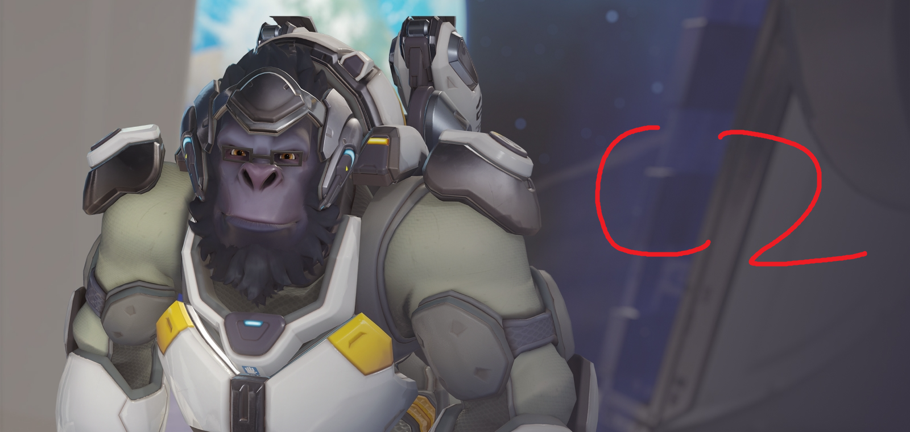
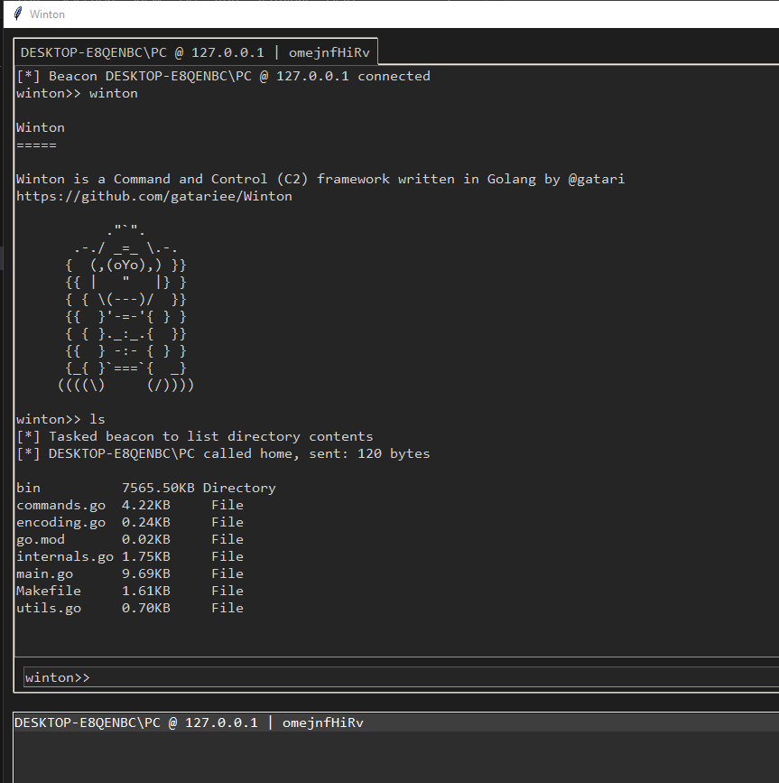
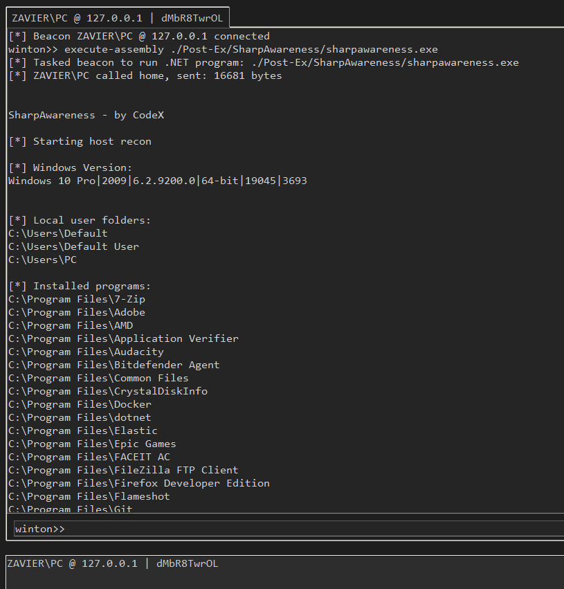
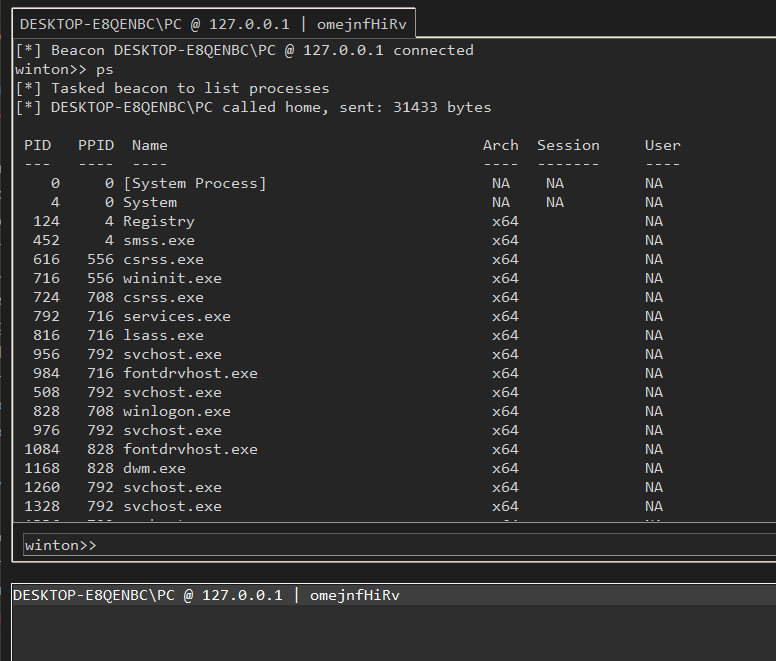
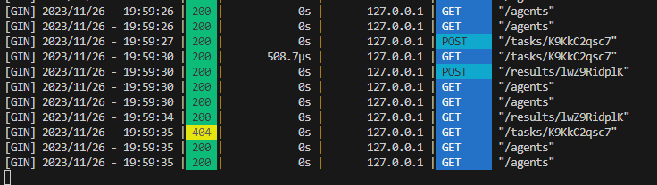

<div align="center">
    <h1>Winton</h1>

<i>Yet another Command and Control (C2) framework written in Golang</i>
</div>

Winton is an open-source cross-platform C2 framework written for the purposes of adversary emulation and red teaming, and is heavily inspired by the [Havoc](https://github.com/HavocFramework/Havoc) Framework by [@C5pider](https://twitter.com/C5pider)

> 🐒 Winton was designed solely for educational purposes, and is still in early stages of development and may be unstable. 



> This project was made to learn more about C2 internals, OPSEC considerations in beacon and to learn Golang _(i still can't get function imports to work)_.

## Table of Contents
- [Winton](#winton)
  - [Table of Contents](#table-of-contents)
  - [Features](#features)
    - [Teamserver](#teamserver)
    - [Implant](#implant)
    - [Client](#client)
  - [Installation](#installation)
    - [Teamserver](#teamserver-1)
    - [Implant](#implant-1)
    - [Client](#client-1)
  - [Usage](#usage)
    - [Teamserver](#teamserver-2)
    - [Client](#client-2)
  - [Development](#development)
    - [Python API References](#python-api-references)
  - [OPSEC Considerations](#opsec-considerations)
    - [Implant](#implant-2)
    - [Client](#client-3)
    - [Teamserver](#teamserver-3)

## Features
### Teamserver
> Written in Golang 1.21.1 with Gin (tested on Windows/AMD64)
- Support for multiple listeners (HTTP implemented)
- Multiplayer-mode
- Cross-platform

### Implant
> Written in Golang 1.21.1 (tested on Windows/AMD64) 
- Process migration and process injection
- In-memory .NET assembly execution (creds to: [@ropnop](https://github.com/ropnop/go-clr))
- Task queuing via named pipes
- Built-ins via `os/exec` & `os/user`
- There are 2 implants available:
    - `Orisa` is written in C and is extremely unstable, and has limited functionality to `ls`, `pwd` and `whoami`.
    - `Sigma` is written in Golang and is much more stable, and has more functionality than `Orisa`.

### Client
> Dark themed UI written in Python with Tkinter
- Multi-player
- In-memory .NET assembly execution via `execute-assembly`

  - creds: [SharpAwareness](https://github.com/CodeXTF2/SharpAwareness) by [@CodeXTF2](https://twitter.com/codex_tf2)
  - for some reason, if you try to load .NET assemblies that are too large, the CLR will just not load lol.
- Heavy reliance on Winton's Python API, see [Python API References](#python-api-references) for more info.
- Updated list of supported commands available: [here](./client/Winton/globals.py#)


## Installation
### Winton
```bash
git clone https://github.com/gatariee/Winton
cd Winton
```

### Teamserver
```bash
cd teamserver
make linux # or windows
cd ./bin && chmod +x ./teamserver-x64
```

### Implant
```bash
cd ./implant/Sigma
make windows
```

### Client
```bash
cd ./client
python3 -m pip install -r requirements.txt
chmod +x ./winton.py
```

## Usage
### Teamserver
```bash
./teamserver-x64 <ip> <port> <password>
```

### Client
```bash
./winton.py
```

## Development
### Python API References
> ⚠️ Winton's Python API is badly written and incomplete!
- Consists of several dataclasses that represent structs returned by the teamserver: `Agent`, `File`, `CommandData`, `Command`, `Result`, `ResultList` as well as a `Client` class which handles interaction with the teamserver.
- The `Agent` class represents an agent connected to the teamserver, and contains the following attributes:
    - `IP` - IP address of the agent
    - `Hostname` - Hostname of the agent
    - `Sleep` - Current beacon sleep time
    - `UID` - Unique ID of the agent

- The `Client` class is the main class that handles interaction with the teamserver, and is the only class that should be used by the client.
    - Important `Client` methods include:
        - `get_agents()` - returns a list of `Agent` objects representing the agents connected to the teamserver.
        - `send_task(agent, task)` - sends a task to the specified agent, returns a `Command` object representing the task.
        - `get_results(agent, command)` - returns a `ResultList` object representing the results of the specified command.

## OPSEC Considerations / Notes
### Implant
- The stable implant is written in Go and produces a binary of ~7,747,072 bytes, or ~7.38MB.
- `shell` pipes the input of the operator to `cmd.exe /c {task}`, which spawns a new `cmd.exe` process on the target and returns the output via `stdout` & `stderr`.
- Heavy reliance on Golang's `os/exec` and `os/user` packages for cross-platform compatibility and built-ins (`whoami`, `pwd`, `ls`), may be OPSEC unsafe.
- `inject` uses `CreateRemoteThread` and doesn't check for architecture, may result in the process and/or shellcode crashing- use `ps` to check for architecture before injection.

    - `VirtualAllocEx` is called with PAGE_EXECUTE_READWRITE & unbacked memory allocation
    - Thread start address is `0x0`
> ⚠️ Beacon instability mainly caused by the implementation of task queuing and tagging in the teamserver, there is a permanent race condition between the teamserver and the implant that causes the implant to crash if the teamserver sends a task to the implant while the implant is still processing a task.

### Client
- Unencrypted communication with the teamserver over HTTP
- Authentication with teamserver not implemented yet
- Interacts with the listener rather than the teamserver, the operator should be interacting with the internal teamserver API instead of the listener. (modularity)


### Teamserver
- Unencrypted communication with the implant over HTTP
- Teamserver expects agent to be legitimate and doesn't check for authentication
- Agents are stored in memory, and not persisted to disk
